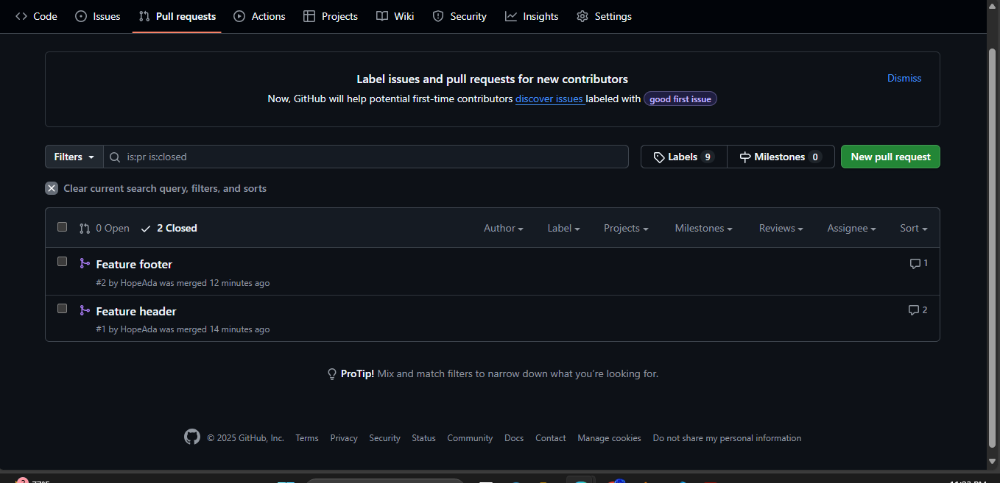

# -Frontend-version-control-task-Adama-Asenath

This repository is made with the purpose of demonstrating my knowledge of git and github for the Flexisaf Internship (Frontend Intermediate)

My Branch Names are:
1. feature-header: For the header part of index.html

2. feature-footer: For the footer part of index.html. This was later renamed to my-footer-feature, serving the same purpose.

Screenshot of merged PRS:

Git Commands I used most frequently:

1. git add .
2.  git commit -m
3. git switch
4. git push
5. git pull

Lessons I learnt during this task:
1. I now understand branching, and how to use it effectively to work on different features separately without affecting the main project

2. I now understand the need for writing proper commit messages for understanding

3. I now understand how to revert commits and make changes when mistakes are made

4. I overall learnt how Git is used for collaboration, version tracking, and structured project management.
